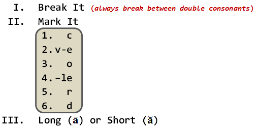

# Syllables
### 3-28-13

--- &vertical

## Q-Review Phonemic/Phonological Awareness

  

***

## Define 'Em

  

***

## Diphthong vs.Vowel Digraph
   

  

***

## Consonant Matching

  

***

## Vowel Matching

  

--- &vertical 

## Syllabication

  

*Corresponds with the Syllable Affix Stage*

***

## Quick Syllable Classification

  

   

***

### Six Types of Syllables in English

---

