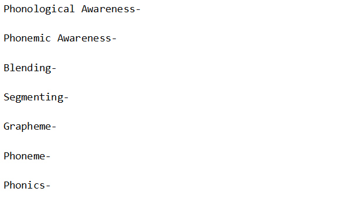
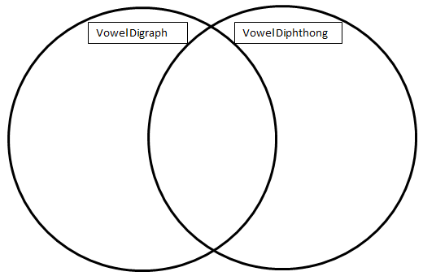
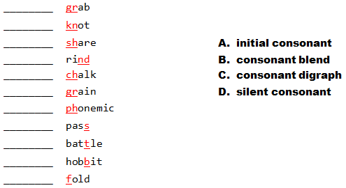
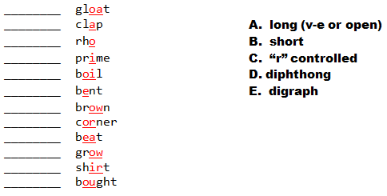
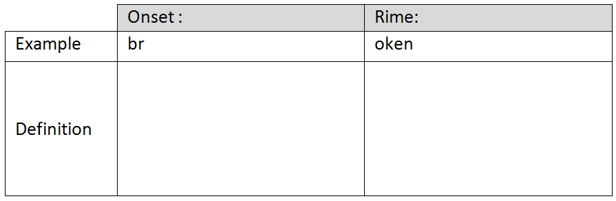
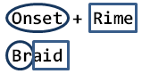
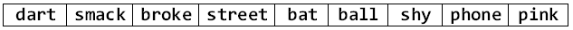
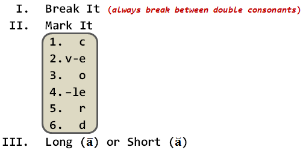

# Syllables


### 3-28-13

--- &vertical

## Q-Review Phonemic/Phonological Awareness

<div style="width:420px;margin:auto;">
  <p></p>
</div>

*** =pnotes

These are some notes

***

## Define 'Em

<div style="width:720px;margin:auto;">
  <p></p>
</div>

***

## Diphthong vs.Vowel Digraph
   
<div style="width:720px;margin:auto;">
  <p></p>
</div>

***

## Consonant Matching

<div style="width:720px;margin:auto;">
  <p></p>
</div>

***

## Vowel Matching

<div style="width:720px;margin:auto;">
  <p></p>
</div>

--- &vertical

## Onset and Rime
```
onset + rime = 1 syllable word
```
```
br + oke = 1 syllable word
```

***

## Define It

<div style="width:720px;margin:auto;">
  <p></p>
</div>

***

## Importance


- Instrumental in dealing with word families

***

### Break the Following Into Onset and Rime




--- &vertical 

## Syllabication
<div style="width:420px;margin:auto;">
  <p></p>
</div>

<center>*Corresponds with the Syllable Affix Stage*</center>

***

## Quick Syllable Classification
<div style="width:720px;margin:auto;">
  <p></p>
</div>   

***

### Six Types of Syllables in English

1. Six types Guided Practice
2. Marking Syllables Joint Practice
3. Marking Syllables Individual 


